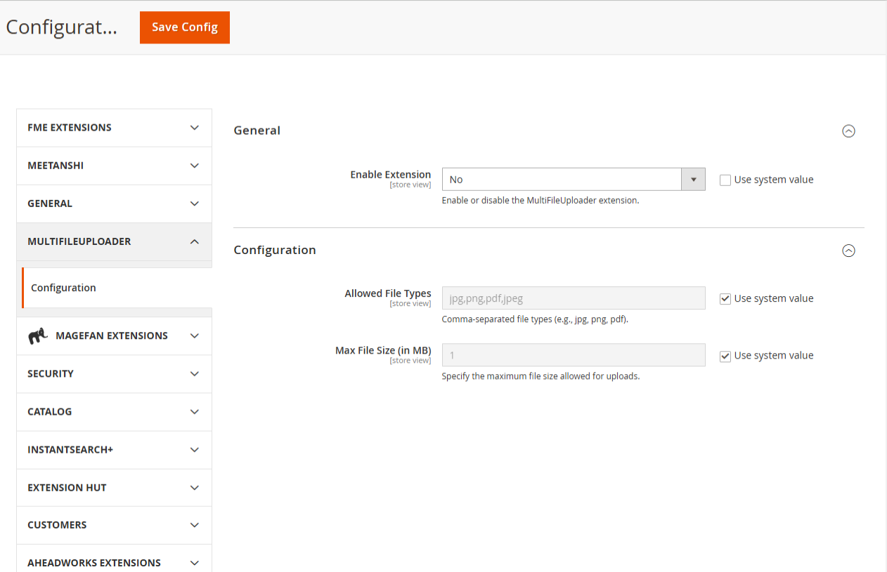
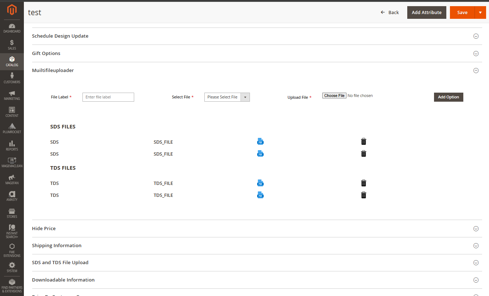
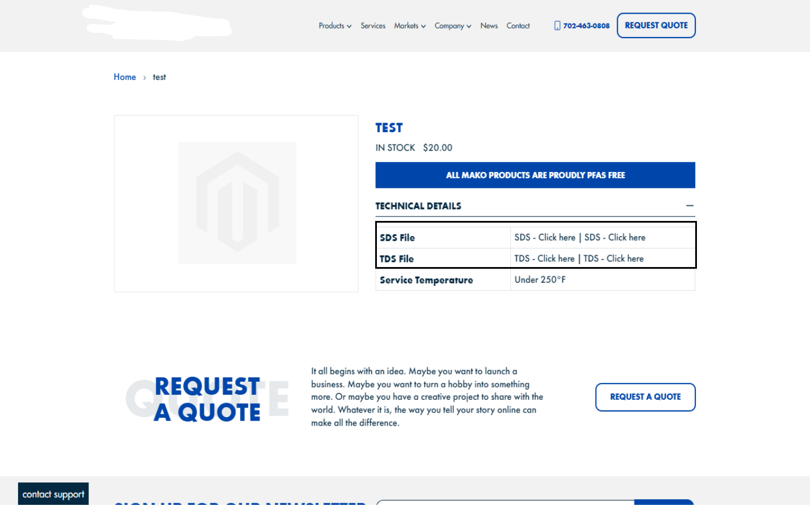
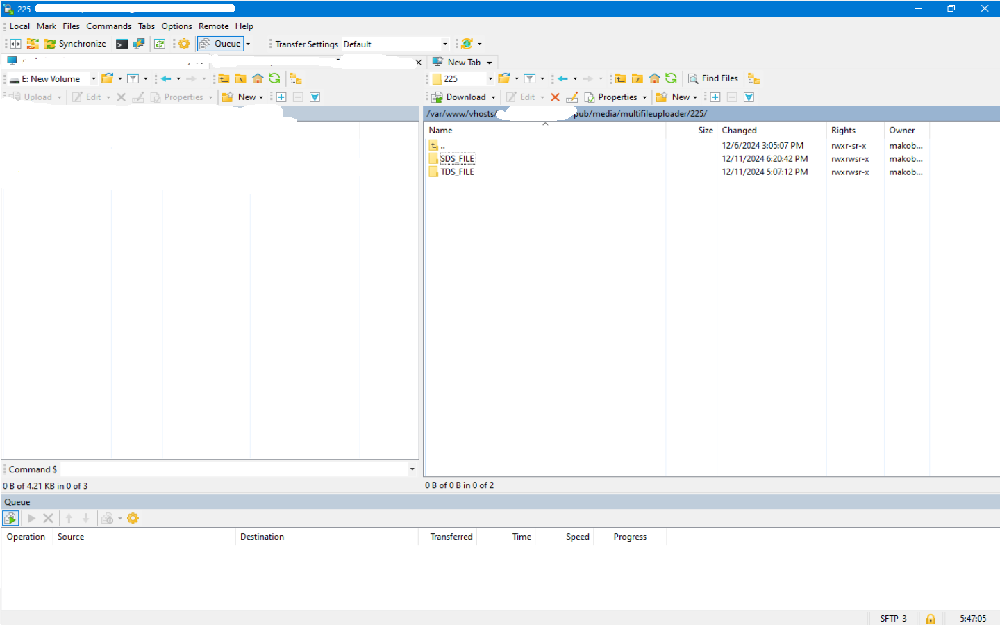
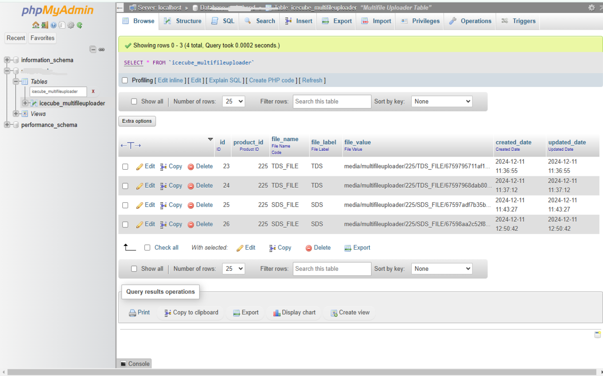

# Icecube_Multifileuploader Extension

The **Icecube_Multifileuploader** extension provides functionality for uploading multiple files in Magento. This extension allows administrators to configure the file types, size limits, and enables a seamless file upload interface on the product form in the Magento Admin Panel.

If you want to upload multiple files for each product, this extension will be very helpful for you. Through this, you can upload multiple files and display them on the product page.


## Features

- Upload multiple files via Magento Admin Panel.
- Configure allowed file types (e.g., `.jpg`, `.png`, `.pdf`).
- Set a maximum file size limit for uploads (in MB).
- Integrates with product form galleries for easy management.

## Installation

### Step 1: Install the Extension

1. Download or clone the `Icecube_Multifileuploader` extension.
2. Place the extension directory into `app/code/Icecube/Multifileuploader`.
3. Run the following commands to install the extension:

   ```bash
   php bin/magento setup:upgrade
   php bin/magento setup:di:compile
   php bin/magento setup:static-content:deploy -f
   php bin/magento cache:flush


## Admin Configuration

### Store -> Configuration -> MultiFileUploader -> Configuration



### Catalog -> Product -> Open any product -> Click on MultiFileUploader




## Frontend

**Note**: This module will only be visible on the frontend if it is enabled in the system configuration.




## Directory Structure

The files will be saved in the following directory structure:

- `pub/media/multifileuploader`
- Product-specific files will be saved under: `pub/media/multifileuploader/product_id/SDS_File` and `pub/media/multifileuploader/product_id/TDS_File`




## Database Table 



